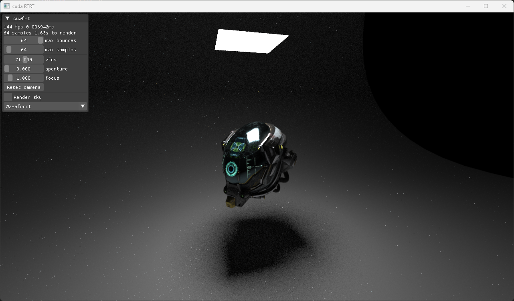

# cuwfrt

Raytracer written in CUDA

## Features
- Wavefront rendering [Laine et al. (2013)](https://research.nvidia.com/sites/default/files/pubs/2013-07_Megakernels-Considered-Harmful/laine2013hpg_paper.pdf)
- Multiple importance sampling with next event estimation
- Binary SAH BVH upload to GPU
- Materials
  - Diffuse, Mirror, Dielectric, PBR(Trowbridge-Reitz GGX) and Diffuse area light
- Model loaders
  - [tinyobjloader](https://github.com/tinyobjloader/tinyobjloader) and [tinygltf](https://github.com/syoyo/tinygltf)
- Interaction with [imgui](https://github.com/ocornut/imgui) and CUDA/OpenGL

---

 | 
|--|--|

 | 
|--|--|

## Architecture Diagram

## Building
- Install [CMake](https://cmake.org/install/) and [CUDA Toolkit](https://developer.nvidia.com/cuda-toolkit-archive)
- Ensure CMake is in the system PATH
- Clone the repository git clone https://github.com/Sopiro/cuwfrt.git
- Run `build.bat`