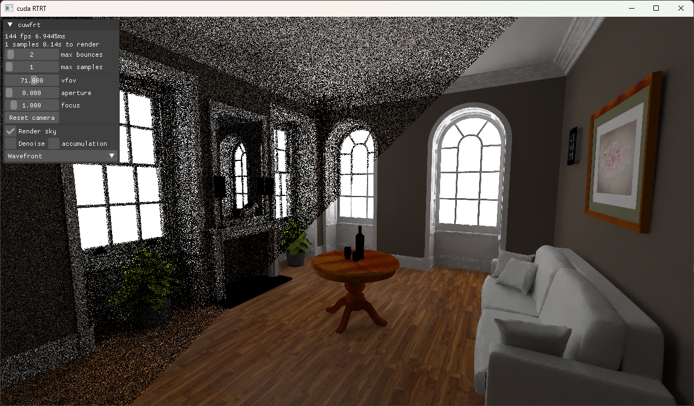

# cuwfrt

Wavefront raytracer written in CUDA

## Features
- Wavefront rendering [Laine et al. (2013)](https://research.nvidia.com/sites/default/files/pubs/2013-07_Megakernels-Considered-Harmful/laine2013hpg_paper.pdf)
- Multiple importance sampling with next event estimation [Veach and Guibas (1995)](https://graphics.stanford.edu/papers/combine/)
- SVGF realtime denoising [Schied et al. (2017)](https://research.nvidia.com/sites/default/files/pubs/2017-07_Spatiotemporal-Variance-Guided-Filtering%3A//svgf_preprint.pdf)
- Temporal Anti-Aliasing [Karis (2014)](https://advances.realtimerendering.com/s2014/epic/TemporalAA.pptx)
- Binary SAH BVH upload to GPU
- Materials
  - Diffuse, Mirror, Dielectric, PBR(Trowbridge-Reitz GGX) and Diffuse Area Light
- Model loaders
  - [tinyobjloader](https://github.com/tinyobjloader/tinyobjloader) and [tinygltf](https://github.com/syoyo/tinygltf)
- Interaction with [imgui](https://github.com/ocornut/imgui) and CUDA/OpenGL interop

---

 | 
|--|--|

 | 
|--|--|

 | 
|--|--|

## Architecture Diagram

## Building
- Install [CMake](https://cmake.org/install/) and [CUDA Toolkit](https://developer.nvidia.com/cuda-toolkit-archive)
- Ensure CMake is in the system PATH
- Clone the repository git clone https://github.com/Sopiro/cuwfrt.git
- Run `build.bat`

## Models
- [Sponza](https://github.com/KhronosGroup/glTF-Sample-Models/tree/main/2.0/Sponza)
- [LTE orb](https://github.com/lighttransport/lighttransportequation-orb?tab=readme-ov-file) by [MirageYM](https://github.com/MirageYM)
- [Ford Mustang 1965](https://sketchfab.com/3d-models/ford-mustang-1965-5f4e3965f79540a9888b5d05acea5943) by [Pooya_dh](https://sketchfab.com/Pooya_dh)
- [The Grey & White Room](https://blendswap.com/blend/13552) by [Wig42](https://blendswap.com/blend/13552)
- [The White Room](https://blendswap.com/blend/5014) by [Jay-Artist](https://blendswap.com/profile/1574)
